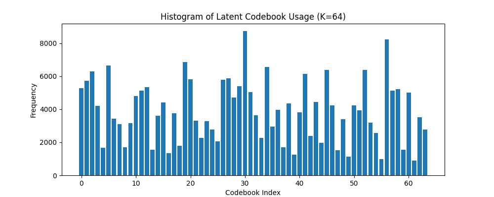

# Taming Transformers: A PyTorch Implementation

This repository contains a PyTorch implementation of the paper **[Taming Transformers for High-Resolution Image Synthesis](https://arxiv.org/abs/2012.09841)**.

This project explores the combination of VQ-VAE and GANs (VQ-GAN) to generate high-quality images, followed by a Transformer-based model to learn the prior over the latent space.

For essential background, it is highly recommended to review the original VQ-VAE architecture first and to already know GAN basics. You can find a great reference implementation here: [vq-vae](https://github.com/thibmonsel/vqvae).

# Datasets used 
 
The models have been trained and validated on the following datasets:

*   **MNIST**: Used for initial validation of the VQ-GAN training.
*   **[Caltech-UCSD Birds-200-2011](https://huggingface.co/datasets/bentrevett/caltech-ucsd-birds-200-2011)**: Used as the primary dataset for high-resolution image synthesis.

Support for the following datasets is also included, offering a great starting point for further experimentation:
*   **[Oxford Flowers 102](https://huggingface.co/datasets/dpdl-benchmark/oxford_flowers102)**
*   **[Animals-10](https://huggingface.co/datasets/dgrnd4/animals-10)**

# Usage Instructions
## 1. Setup

Please clone and install repository to get all required dependencies :
```bash
git clone https://github.com/thibmonsel/taming_transformer.git
cd taming_transformer
pip install .
```

## 2. Training Models

We provide convenient bash scripts to streamline the training process for both the MNIST and Birds datasets. These scripts handle the two-stage training pipeline:

- Train the VQ-GAN: This learns a powerful image encoder and decoder.
- Train the Transformer Prior: This learns the distribution of the latent codes.

To start training, simply run the desired script. You can customize hyperparameters within the script to optimize for your specific needs. A GPU is strongly recommended for training these models in a reasonable amount of time.

For MNIST :

```bash
bash mnist_launch.sh
```

For Birds : 

```bash 
bash birds_launch.sh
```

## 3. Results

### MNIST 

*VQ-GAN training*

<p align="center">
    
</p>
<p align="center"><strong> VQ-GAN training curves </strong></p>

<p align="center">
    
</p>
<p align="center"><strong>VQ-GAN reconstruction samples </strong></p>

<p align="center">
    
</p>
<p align="center"><strong>VQ-GAN Histogram codebook usage</strong></p>

<p align="center">
    
</p>
<p align="center"><strong>VQ-GAN sample generation from random latents</strong></p>


<p align="center">
    
</p>
<p align="center"><strong>Cobebook embedding visualization </strong></p>


*Conditioned prior model training*

<div align="center">
  
  <p><strong>Transformer Prior loss curves (Class-Conditioned)</strong></p>
</div>

<div align="center">
  
  <p><strong>Sampling with trained prior model (Class-Conditioned)s</strong></p>
</div>


# Notes

I do find that the VQ-GAN's paper Table 7 is rather misleading, on the GAN's implementation architecture. I found it easier to go see the [source code](https://github.com/CompVis/taming-transformers/blob/master/taming/modules/diffusionmodules/model.py#L342).